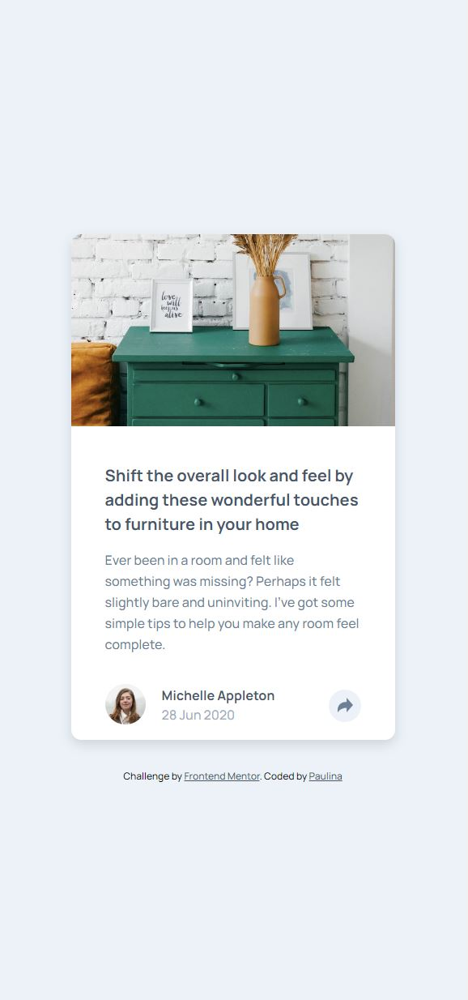
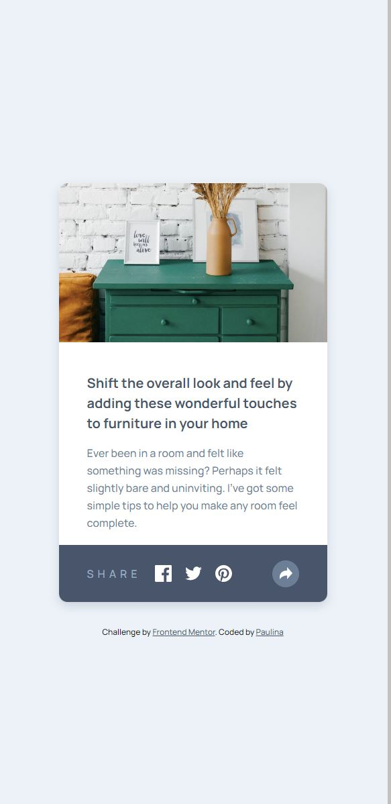
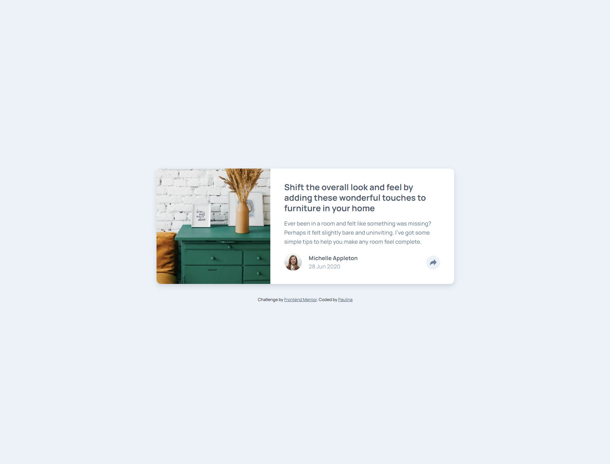
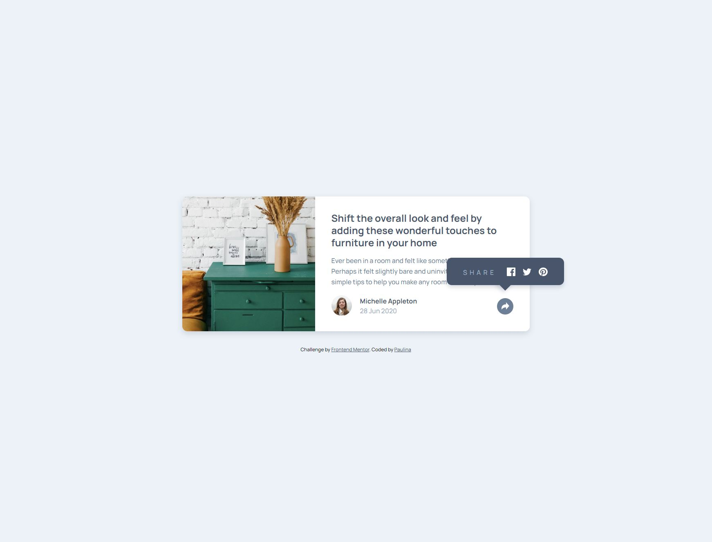

# Frontend Mentor - Article preview component solution

This is a solution to the [Article preview component challenge on Frontend Mentor](https://www.frontendmentor.io/challenges/article-preview-component-dYBN_pYFT).

## Table of contents

- [Overview](#overview)
  - [The challenge](#the-challenge)
  - [Screenshots](#screenshots)
  - [Link](#link)
- [My process](#my-process)
  - [Design](#design)
  - [Development](#development)
  - [Built with](#built-with)
  - [What I learned](#what-i-learned)

## Overview

This project represents a responsive social media sharing card with various hover and click effects.
When the share icon is clicked, the user's profile information should be replaced by sharing options.

### The challenge

Users should be able to:

- View the optimal layout for the component depending on their device's screen size
- See the social media share links when they click the share icon

### Screenshots

### Link

- Live Site URL: [Add live site URL here](https://your-live-site-url.com)

## My process

### Design
I was provided with a design for this project from Frontend Mentor. The design was clear and user-friendly. I had to recreate this design and bring it to life using HTML, CSS, and JavaScript.

### Development 
Development was done with HTML, CSS, and JavaScript. The HTML created the structure for the sharing card, while CSS provided styling. I used JavaScript to add the functionality to the share button, allowing the user to toggle between viewing the profile and sharing options.

### Built with

- Semantic HTML5 markup
- CSS custom properties
- Flexbox
- CSS Grid
- JavaScript
- Mobile-first workflow

### What I learned

This project helped to strengthen my skills in creating responsive designs and working with JavaScript to add interactivity to a page. I gained a deeper understanding of event listeners and manipulating the DOM. 

